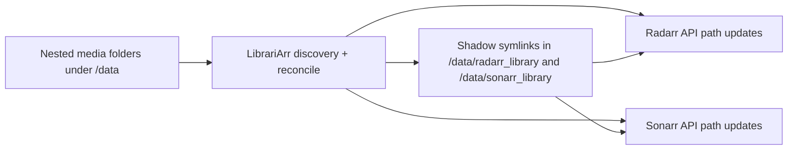

# LibrariArr

LibrariArr keeps real media folders in your preferred nested structure while continuously syncing flat library views for Radarr and Sonarr.

It solves the path drift problem between your filesystem and *arr apps by maintaining symlinks and updating managed paths automatically.

## What Problem It Solves

Many libraries are organized for humans (age buckets, studio folders, custom hierarchies), while Radarr and Sonarr work best with flat root folders.

Without synchronization, this causes:

- imports that fail because *arr paths no longer match real folders,
- stale entries after external renames or moves,
- extra manual path fixing in Radarr/Sonarr,
- brittle workflows when multiple tools touch the same files.

LibrariArr bridges that gap and keeps both sides aligned.

## Core Features

- Continuous sync for Radarr and Sonarr paths using filesystem events plus scheduled maintenance reconciles.
- Shadow-link projection from nested roots into flat roots (`paths.root_mappings`).
- Season-aware series discovery for Sonarr and movie-folder discovery for Radarr.
- Optional auto-add for unmatched folders (`radarr.auto_add_unmatched`, `sonarr.auto_add_unmatched`).
- Optional ingest mode to move real folders from shadow roots back into nested storage.
- Orphan cleanup and missing-source actions (none/unmonitor/delete) for both Radarr and Sonarr.
- Debounced refresh calls to avoid API spam during noisy rename/import bursts.

## Sync Architecture



## How It Works

Example:

```text
/data/movies/
  age_12/Studio/Foo (2020)/Foo.2020.1080p.x265.mkv
  age_16/Other/Bar (2011)/Bar.2011.2160p.REMUX.mkv

/data/radarr_library/
  Foo (2020) -> /data/movies/age_12/Studio/Foo (2020)
  Bar (2011) -> /data/movies/age_16/Other/Bar (2011)
```

On reconcile, LibrariArr:

1. Discovers media folders in nested roots.
2. Creates/repairs symlinks in mapped shadow roots.
3. Matches items in Radarr/Sonarr and updates managed paths.
4. Applies optional quality/auto-add/cleanup behavior.

## Quick Start (Docker)

These steps assume you checked out this repository locally.

1. Copy defaults:

```bash
cp config.yaml.example config.yaml
cp .env.example .env
```

2. Set writable host paths in `.env` (single-root best practice):

```dotenv
MEDIA_ROOT=/volume2
PUID=1000
PGID=1000
```

Use one shared top-level mount (`MEDIA_ROOT`) across all *arr services and LibrariArr for reliable atomic moves and consistent path resolution.

3. Start and verify:

```bash
./run.sh up
./run.sh logs
```

4. Stop when needed:

```bash
./run.sh down
```

If you mainly use Docker Desktop/Portainer UI, use the compose files linked in "More Details" and apply the same `.env` + `config.yaml` setup.

## Minimal Config Example

```yaml
paths:
  root_mappings:
    - nested_root: "/data/movies/age_12"
      shadow_root: "/data/radarr_library/age_12"

radarr:
  enabled: true
  url: "http://radarr:7878"
  api_key: "YOUR_API_KEY"
  sync_enabled: true

sonarr:
  enabled: false
  url: "http://sonarr:8989"
  api_key: "YOUR_API_KEY"
  sync_enabled: true
```

## Integration Checklist

- Radarr/Sonarr and LibrariArr must all mount the same top-level media root to `/data`.
- Keep nested and shadow folders under that shared root (for example `/data/movies`, `/data/radarr_library`, `/data/sonarr_library`).
- Add mapped shadow roots as root folders in Radarr/Sonarr.
- Keep `radarr.enabled=true` for movie processing, `sonarr.enabled=true` for series processing.
- Use `*.sync_enabled=false` when you want symlink-only mode without API updates.
- If API sync is enabled and updates fail, check path parity across containers first.

## More Details

- Full option reference: [docs/configuration.md](docs/configuration.md)
- Example baseline: [config.yaml.example](config.yaml.example)
- Main compose file: [docker/docker-compose.yml](docker/docker-compose.yml)
- Dev compose file: [docker/docker-compose.dev.yml](docker/docker-compose.dev.yml)
- Full stack compose example (Sabnzbd/Radarr/Sonarr/Prowlarr/LibrariArr/Mediathekarr, documentation-only): [docker-compose.full-stack.example.yml](docker-compose.full-stack.example.yml)
- Wrapper help script: [run.sh](run.sh)

## Runtime and Test Commands (Repo Checkout)

These are mainly useful for contributors or users running this repository directly.

- `./run.sh once` for single reconcile.
- `./run.sh test` for unit/integration tests (non-e2e).
- `./run.sh e2e` for Arr end-to-end tests (Radarr + Sonarr).
- `./run.sh fs-e2e` for filesystem-focused end-to-end tests.
- `./run.sh quality` for lint/format/complexity checks.
