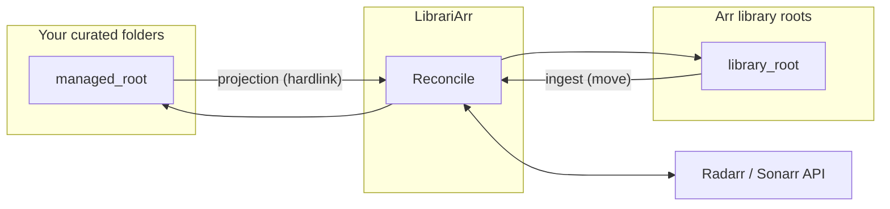

# LibrariArr

LibrariArr keeps real media folders in your preferred nested structure while continuously syncing library views for Radarr and Sonarr.

It solves the path drift problem between your filesystem and *arr apps by projecting managed
media into curated library roots with hardlinks.

## What Problem It Solves

Many libraries are organized for humans (age buckets, studio folders, custom hierarchies), while Radarr and Sonarr work best with flat root folders.

Without synchronization, this causes:

- imports that fail because *arr paths no longer match real folders,
- stale entries after external renames or moves,
- extra manual path fixing in Radarr/Sonarr,
- brittle workflows when multiple tools touch the same files.

LibrariArr bridges that gap and keeps both sides aligned.

## Status

LibrariArr is a personal project built to scratch a real itch. It runs on an actual media library and is developed iteratively — which means it works, but it is not hardened software with enterprise guarantees.

**Use at your own risk.** Before pointing it at a library you care about, take a backup. Hardlinks are non-destructive by nature, but path updates and ingest moves are real filesystem operations. The authors make no warranty, express or implied.

A fair portion of this codebase was shaped through conversational AI collaboration — what some call vibe coding. The architecture was designed deliberately, the logic was reasoned through carefully, and the tests exist for a reason. But if something goes sideways in an unexpected corner case, that's between you and the universe.

## Core Features

- **Hardlink projection** (managed → library): projects video files and allowlisted extras from your curated folders into flat Arr-compatible library roots using hardlinks. Zero storage overhead.
- **Two-tier ingest** (library → managed): when Radarr imports a new movie, the entire folder is moved into your curated tree. When Radarr upgrades quality, file-level inode comparison detects the replacement and moves the new file in (backing up the old one first).
- **Auto-discovery**: scans managed roots for folders not yet in Radarr/Sonarr, looks up each title via the Radarr/Sonarr API, and auto-adds matches with configurable quality profiles. Folders that don't match are skipped and retried on change.
- **Webhook-scoped reconcile**: Radarr/Sonarr Connect webhooks trigger targeted per-movie/series reconcile within seconds instead of waiting for periodic scans.
- **Filesystem watchers + periodic reconcile**: filesystem events trigger debounced incremental reconcile; scheduled full reconcile catches any drift.
- **Idempotent and safe**: relink-on-replace for changed files, unknown user files in library roots are never touched.
- **Web UI**: dashboard with real-time status, config editor with validation, path mapping explorer, and log viewer.

## Sync Architecture



## How It Works

You organize movies however you like — age buckets, collections, studios. LibrariArr projects them into the flat structure Radarr expects, using hardlinks (same content, zero extra storage).

```yaml
# config.yaml — one mapping per age bucket
paths:
  movie_root_mappings:
    - managed_root: "/data/movies/age_12"
      library_root: "/data/radarr_library/age_12"
    - managed_root: "/data/movies/age_16"
      library_root: "/data/radarr_library/age_16"
```

| Your folders | What Radarr sees | Notes |
|---|---|---|
| `…/age_12/Foo (2020)/Foo.mkv` | `…/age_12/Foo (2020)/Foo.mkv` | direct child → flat |
| `…/age_16/Bar (2011)/Bar.mkv` | `…/age_16/Bar (2011)/Bar.mkv` | direct child → flat |
| `…/age_12/Studio/Qux (2023)/Qux.mkv` | `…/age_12/Qux (2023)/Qux.mkv` | `Studio/` stripped — always flat |

No matter how deep your managed folder structure is, Radarr always sees a flat `Title (Year)/` folder directly under its root. Intermediate directories (studios, collections, genres) are stripped automatically.

On reconcile, LibrariArr:

1. **Ingests** new/upgraded files from library roots back into managed roots.
2. **Normalizes paths** so Radarr/Sonarr always point to library roots.
3. **Projects** managed video and allowlisted extras into library roots via hardlinks.
4. **Discovers** unmatched folders in managed roots and auto-adds them to Radarr/Sonarr.

## Common Sync Scenarios

### When Radarr downloads a new movie

1. Radarr places the movie in a library root (its configured root folder).
2. Webhook or filesystem event triggers reconcile.
3. **Folder-level ingest** moves the entire folder from library root into your managed root.
4. **Projection** hardlinks the files back into the library root.
5. Result: movie lives in your curated tree; Radarr still sees it in the library root.

### When Radarr upgrades quality

1. Radarr replaces the video file in the library root with a better version (new file, different inode).
2. **File-level ingest** detects the inode mismatch and:
   - backs up the old file in managed root (temp suffix),
   - **moves** the upgraded file from library root into managed root (same filename Radarr gave it),
   - deletes the old backup on success.
3. **Projection** re-hardlinks the upgraded file back into the library root.
4. Result: your curated folder has the upgraded file; no duplicates remain.

> **Extras handling**: allowlisted extras (subtitles, `movie.nfo`, posters — see `managed_extras_allowlist`) are projected and ingested alongside video files. Non-allowlisted extras are left in the library root.
>
> **Tip**: enable Radarr's "Movie Metadata" setting (*Settings → Metadata → Kodi (XBMC) / NFO*) so Radarr writes a fresh `movie.nfo` after each import or upgrade. This ensures metadata always matches the current video file.

### When you add a movie folder manually

1. Drop a folder into your managed root following the `Title (Year)` naming convention.
2. LibrariArr parses the folder name, searches Radarr for a match, and auto-adds it (if `auto_add_unmatched` is enabled).
3. **If no Radarr match is found** (unknown title, ambiguous name), the folder is **skipped** and a warning is logged. It will be retried automatically when the folder is modified.
4. Projection hardlinks the files into the library root so Radarr can see them.

### When you rename or move a movie folder

1. Filesystem events trigger incremental reconcile.
2. Projection updates hardlinks to match the current managed folder state.
3. Radarr's path is updated via API if needed.

## Quick Start (Users: Docker Compose)

These steps are for regular Docker users (Docker CLI, Docker Desktop, or Portainer), not local repository development.

1. Copy defaults:

```bash
cp config.yaml.example config.yaml
cp .env.example .env
```

2. Set writable host paths in `.env` (single-root best practice):

```dotenv
MEDIA_ROOT=/volume2
PUID=1000
PGID=1000
```

Use one shared top-level mount (`MEDIA_ROOT`) across all *arr services and LibrariArr for reliable atomic moves and consistent path resolution.

3. Use the provided full-stack example compose file at the repository root:

```yaml
services:
  sabnzbd:
    image: lscr.io/linuxserver/sabnzbd:latest
    env_file: .env
    volumes:
      - ${CONFIG_ROOT}/sabnzbd:/config
      - ${MEDIA_ROOT}:/data

  radarr:
    image: lscr.io/linuxserver/radarr:latest
    env_file: .env
    volumes:
      - ${CONFIG_ROOT}/radarr:/config
      - ${MEDIA_ROOT}:/data

  sonarr:
    image: lscr.io/linuxserver/sonarr:latest
    env_file: .env
    volumes:
      - ${CONFIG_ROOT}/sonarr:/config
      - ${MEDIA_ROOT}:/data

  librariarr:
    image: ghcr.io/vtietz/librariarr:latest
    env_file: .env
    volumes:
      - ${CONFIG_ROOT}/librariarr:/config
      - ${MEDIA_ROOT}:/data
    ports:
      - "8787:8787"
    command: ["--config", "/config/config.yaml", "--log-level", "INFO", "--web"]
```

4. Start and verify:

```bash
docker compose -f docker-compose.full-stack.example.yml up -d
docker compose -f docker-compose.full-stack.example.yml logs -f librariarr
```

Then open `http://localhost:8787` for the LibrariArr GUI.

### Linux note: inotify watch limits

Large media libraries can exceed Linux's default inotify watch limit. When this
happens LibrariArr logs a warning and falls back to **polling mode**, which scans
for changes once per minute instead of reacting instantly.

Check your current limits:

```bash
cat /proc/sys/fs/inotify/max_user_watches
cat /proc/sys/fs/inotify/max_user_instances
```

To restore instant detection, increase the limit on the **Docker host** (not
inside the container):

```bash
sudo sysctl -w fs.inotify.max_user_watches=524288
sudo sysctl -w fs.inotify.max_user_instances=1024
```

Persist after reboot:

```bash
printf 'fs.inotify.max_user_watches=524288\nfs.inotify.max_user_instances=1024\n' | \
  sudo tee /etc/sysctl.d/99-librariarr-inotify.conf
sudo sysctl --system
```

After applying the fix, restart the LibrariArr container. The log will confirm
whether inotify or polling mode is active.

5. Stop when needed:

```bash
docker compose -f docker-compose.full-stack.example.yml down
```

## Minimal Config Example

```yaml
paths:
  movie_root_mappings:
    - managed_root: "/data/movies/age_12"       # your curated folder
      library_root: "/data/radarr_library/age_12" # Radarr's root folder
  series_root_mappings:
    - nested_root: "/data/series/age_12"         # your curated folder
      shadow_root: "/data/sonarr_library/age_12" # Sonarr's root folder

radarr:
  enabled: true
  url: "http://radarr:7878"
  api_key: "YOUR_API_KEY"
  sync_enabled: true
  auto_add_unmatched: true  # auto-import unmatched folders to Radarr

sonarr:
  enabled: false
  url: "http://sonarr:8989"
  api_key: "YOUR_API_KEY"
  sync_enabled: true
```

> **Naming note**: Radarr mappings use `managed_root`/`library_root`. Sonarr mappings currently use `nested_root`/`shadow_root` (same concept, naming migration pending).

## Integration Checklist

- All containers (Radarr, Sonarr, LibrariArr) must mount the same top-level media root to `/data`.
- Keep managed folders and library folders under that shared root (e.g. `/data/movies`, `/data/radarr_library`).
- In Radarr: add each `library_root` as a root folder. In Sonarr: add each `shadow_root` as a root folder.
- Set up Radarr/Sonarr Connect webhooks to `http://librariarr:8787/api/hooks/radarr` (and `/hooks/sonarr`) for fast scoped reconcile.
- If API sync fails, check that all containers see the same paths (path parity).

## More Details

- Full option reference: [docs/configuration.md](docs/configuration.md)
- Workflow/reference behavior guide: [docs/workflows.md](docs/workflows.md)
- Example baseline: [config.yaml.example](config.yaml.example)
- Main compose file: [docker-compose.yml](docker-compose.yml)
- Dev compose file: [docker-compose.dev.yml](docker-compose.dev.yml)
- Full stack compose example (Sabnzbd/Radarr/Sonarr/Prowlarr/LibrariArr/Mediathekarr, documentation-only): [docker-compose.full-stack.example.yml](docker-compose.full-stack.example.yml)
- Wrapper help script (contributors/local repo dev): [run.sh](run.sh)

## Contributor Commands (Repo Checkout)

These `run.sh` wrappers are for contributors and local repository development.

- `./run.sh once` for single reconcile.
- `./run.sh test` for unit/integration tests (non-e2e).
- `./run.sh e2e` for Arr end-to-end tests (Radarr + Sonarr).
- `./run.sh fs-e2e` for filesystem-focused end-to-end tests.
- `./run.sh quality` for lint/format/complexity checks.

### Dev GUI + Local Arr Stack

Prerequisites:

- Docker with Compose support (`docker compose` or `docker-compose`)
- Writable host media root (`MEDIA_ROOT`) for local folder/bootstrap operations
- A repo-local `config.yaml` file (auto-created by wrappers when missing)

- Create env file: `cp .env.dev.example .env`
- Start full dev stack: `./run.sh dev-up`
- One-time/bootstrap only (optional): `./run.sh dev-bootstrap`
- Seed sample folders/files into configured nested roots (optional): `./run.sh dev-seed`
- GUI API: `http://localhost:8787`
- Vite dev UI: `http://localhost:5173`
- Radarr dev instance: `http://localhost:17878`
- Sonarr dev instance: `http://localhost:18989`
- Tail logs: `./run.sh dev-logs`
- Stop everything: `./run.sh dev-down`

Ports and internal dev URLs can be adjusted in `.env` via `LIBRARIARR_WEB_PORT`,
`LIBRARIARR_DEV_RADARR_URL`, `LIBRARIARR_DEV_SONARR_URL`,
`DEV_HOST_PORT_RADARR`, and `DEV_HOST_PORT_SONARR`.

By default, `dev-up` creates `.env` from `.env.dev.example` when missing and runs
`dev-bootstrap` automatically (`LIBRARIARR_DEV_BOOTSTRAP=0` disables auto-bootstrap).
The bootstrap syncs Arr API keys/URLs into `config.yaml` and `.env`, tries to disable
Arr auth/HTTPS for local dev, and ensures root folders exist.
Before startup, `dev-up` also pre-creates `movies`, `series`, `radarr_library`, and
`sonarr_library` under `MEDIA_ROOT` when the host path is writable.
If host-side creation is blocked by ownership/permissions, `dev-bootstrap` runs an
in-container repair step that creates/chowns mapped `/data` paths before Arr root
folder registration.
