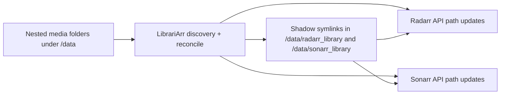

# LibrariArr

LibrariArr keeps real media folders in your preferred nested structure while continuously syncing flat library views for Radarr and Sonarr.

It solves the path drift problem between your filesystem and *arr apps by maintaining symlinks and updating managed paths automatically.

## What Problem It Solves

Many libraries are organized for humans (age buckets, studio folders, custom hierarchies), while Radarr and Sonarr work best with flat root folders.

Without synchronization, this causes:

- imports that fail because *arr paths no longer match real folders,
- stale entries after external renames or moves,
- extra manual path fixing in Radarr/Sonarr,
- brittle workflows when multiple tools touch the same files.

LibrariArr bridges that gap and keeps both sides aligned.

## Core Features

- Continuous sync for Radarr and Sonarr paths using filesystem events plus scheduled maintenance reconciles.
- Embedded web UI for visual config editing, mapping exploration, diagnostics, and dry-runs.
- Shadow-link projection from nested roots into flat roots (`paths.root_mappings`).
- Season-aware series discovery for Sonarr and movie-folder discovery for Radarr.
- Optional auto-add for unmatched folders (`radarr.auto_add_unmatched`, `sonarr.auto_add_unmatched`).
- Optional ingest mode to move real folders from shadow roots back into nested storage.
- Orphan cleanup and missing-source actions (none/unmonitor/delete) for both Radarr and Sonarr.
- Debounced refresh calls to avoid API spam during noisy rename/import bursts.

## Sync Architecture



## How It Works

Example:

```text
/data/movies/
  age_12/Studio/Foo (2020)/Foo.2020.1080p.x265.mkv
  age_16/Other/Bar (2011)/Bar.2011.2160p.REMUX.mkv

/data/radarr_library/
  Foo (2020) -> /data/movies/age_12/Studio/Foo (2020)
  Bar (2011) -> /data/movies/age_16/Other/Bar (2011)
```

On reconcile, LibrariArr:

1. Discovers media folders in nested roots.
2. Creates/repairs symlinks in mapped shadow roots.
3. Matches items in Radarr/Sonarr and updates managed paths.
4. Applies optional quality/auto-add/cleanup behavior.

## Common Sync Scenarios

### When Radarr/Sonarr downloads or imports media

- The download/import creates filesystem events under your nested roots.
- LibrariArr debounces bursts (`runtime.debounce_seconds`) and runs an incremental reconcile.
- Existing movie/series links are reused; paths are updated only when needed.
- If `*.sync_enabled=true`, Radarr/Sonarr paths are kept aligned to shadow links.

### When you rename/move a movie or series folder manually

- Rename/move is detected via filesystem events and queued for incremental reconcile.
- Old/stale symlink is removed as orphan; new symlink is created for the new folder path.
- If the item already matches an Arr record, path is updated and refreshed.
- If no Arr match is found and `radarr.auto_add_unmatched` / `sonarr.auto_add_unmatched` is enabled, LibrariArr attempts auto-add.

### When you add files into an existing folder

- Events are detected and reconciled, but the folder identity often remains unchanged.
- In that case, no new Arr entry is created (existing mapping is preserved).
- You may still see a reconcile run in logs even if resulting link/path changes are zero.

### Why logs may show large `affected_paths`

- `affected_paths` is the raw number of changed paths collected during debounce, not the number of movies/series.
- Single large copy/move operations can generate many filesystem events.
- Incremental scope resolution then narrows this to scan targets before link/match actions are applied.

## Quick Start (Users: Docker Compose)

These steps are for regular Docker users (Docker CLI, Docker Desktop, or Portainer), not local repository development.

1. Copy defaults:

```bash
cp config.yaml.example config.yaml
cp .env.example .env
```

2. Set writable host paths in `.env` (single-root best practice):

```dotenv
MEDIA_ROOT=/volume2
PUID=1000
PGID=1000
```

Use one shared top-level mount (`MEDIA_ROOT`) across all *arr services and LibrariArr for reliable atomic moves and consistent path resolution.

3. Use the provided full-stack example compose file at the repository root:

```yaml
services:
  sabnzbd:
    image: lscr.io/linuxserver/sabnzbd:latest
    env_file: .env
    volumes:
      - ${CONFIG_ROOT}/sabnzbd:/config
      - ${MEDIA_ROOT}:/data

  radarr:
    image: lscr.io/linuxserver/radarr:latest
    env_file: .env
    volumes:
      - ${CONFIG_ROOT}/radarr:/config
      - ${MEDIA_ROOT}:/data

  sonarr:
    image: lscr.io/linuxserver/sonarr:latest
    env_file: .env
    volumes:
      - ${CONFIG_ROOT}/sonarr:/config
      - ${MEDIA_ROOT}:/data

  librariarr:
    image: ghcr.io/vtietz/librariarr:latest
    env_file: .env
    volumes:
      - ${CONFIG_ROOT}/librariarr:/config
      - ${MEDIA_ROOT}:/data
    ports:
      - "8787:8787"
    command: ["--config", "/config/config.yaml", "--log-level", "INFO", "--web"]
```

4. Start and verify:

```bash
docker compose -f docker-compose.full-stack.example.yml up -d
docker compose -f docker-compose.full-stack.example.yml logs -f librariarr
```

Then open `http://localhost:8787` for the LibrariArr GUI.

### Linux note: inotify watch limits

If logs show `OSError: [Errno 28] inotify watch limit reached`, increase host
inotify limits (run on the Docker host, not inside the container):

```bash
sudo sysctl -w fs.inotify.max_user_watches=524288
sudo sysctl -w fs.inotify.max_user_instances=1024
```

Persist after reboot:

```bash
printf 'fs.inotify.max_user_watches=524288\nfs.inotify.max_user_instances=1024\n' | \
  sudo tee /etc/sysctl.d/99-librariarr-inotify.conf
sudo sysctl --system
```

5. Stop when needed:

```bash
docker compose -f docker-compose.full-stack.example.yml down
```

## Minimal Config Example

```yaml
paths:
  root_mappings:
    - nested_root: "/data/movies/age_12"
      shadow_root: "/data/radarr_library/age_12"

radarr:
  enabled: true
  url: "http://radarr:7878"
  api_key: "YOUR_API_KEY"
  sync_enabled: true

sonarr:
  enabled: false
  url: "http://sonarr:8989"
  api_key: "YOUR_API_KEY"
  sync_enabled: true
```

## Integration Checklist

- Radarr/Sonarr and LibrariArr must all mount the same top-level media root to `/data`.
- Keep nested and shadow folders under that shared root (for example `/data/movies`, `/data/radarr_library`, `/data/sonarr_library`).
- Add mapped shadow roots as root folders in Radarr/Sonarr.
- Keep `radarr.enabled=true` for movie processing, `sonarr.enabled=true` for series processing.
- Use `*.sync_enabled=false` when you want symlink-only mode without API updates.
- If API sync is enabled and updates fail, check path parity across containers first.

## More Details

- Full option reference: [docs/configuration.md](docs/configuration.md)
- Example baseline: [config.yaml.example](config.yaml.example)
- Main compose file: [docker-compose.yml](docker-compose.yml)
- Dev compose file: [docker-compose.dev.yml](docker-compose.dev.yml)
- Full stack compose example (Sabnzbd/Radarr/Sonarr/Prowlarr/LibrariArr/Mediathekarr, documentation-only): [docker-compose.full-stack.example.yml](docker-compose.full-stack.example.yml)
- Wrapper help script (contributors/local repo dev): [run.sh](run.sh)

## Contributor Commands (Repo Checkout)

These `run.sh` wrappers are for contributors and local repository development.

- `./run.sh once` for single reconcile.
- `./run.sh test` for unit/integration tests (non-e2e).
- `./run.sh e2e` for Arr end-to-end tests (Radarr + Sonarr).
- `./run.sh fs-e2e` for filesystem-focused end-to-end tests.
- `./run.sh quality` for lint/format/complexity checks.

### Dev GUI + Local Arr Stack

Prerequisites:

- Docker with Compose support (`docker compose` or `docker-compose`)
- Writable host media root (`MEDIA_ROOT`) for local folder/bootstrap operations
- A repo-local `config.yaml` file (auto-created by wrappers when missing)

- Create env file: `cp .env.dev.example .env`
- Start full dev stack: `./run.sh dev-up`
- One-time/bootstrap only (optional): `./run.sh dev-bootstrap`
- Seed sample folders/files into configured nested roots (optional): `./run.sh dev-seed`
- GUI API: `http://localhost:8787`
- Vite dev UI: `http://localhost:5173`
- Radarr dev instance: `http://localhost:17878`
- Sonarr dev instance: `http://localhost:18989`
- Tail logs: `./run.sh dev-logs`
- Stop everything: `./run.sh dev-down`

Ports and internal dev URLs can be adjusted in `.env` via `LIBRARIARR_WEB_PORT`,
`LIBRARIARR_DEV_RADARR_URL`, `LIBRARIARR_DEV_SONARR_URL`,
`DEV_HOST_PORT_RADARR`, and `DEV_HOST_PORT_SONARR`.

By default, `dev-up` creates `.env` from `.env.dev.example` when missing and runs
`dev-bootstrap` automatically (`LIBRARIARR_DEV_BOOTSTRAP=0` disables auto-bootstrap).
The bootstrap syncs Arr API keys/URLs into `config.yaml` and `.env`, tries to disable
Arr auth/HTTPS for local dev, and ensures root folders exist.
Before startup, `dev-up` also pre-creates `movies`, `series`, `radarr_library`, and
`sonarr_library` under `MEDIA_ROOT` when the host path is writable.
If host-side creation is blocked by ownership/permissions, `dev-bootstrap` runs an
in-container repair step that creates/chowns mapped `/data` paths before Arr root
folder registration.
