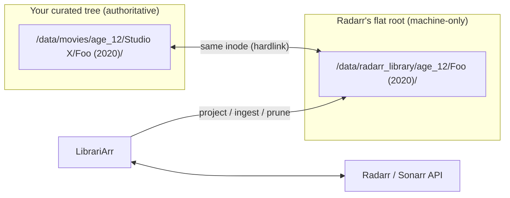

# LibrariArr

LibrariArr keeps real media folders in your preferred nested structure while continuously syncing flat library views for Radarr and Sonarr — using hardlinks and **inode identity**.

Your curated tree stays authoritative. Radarr/Sonarr get the flat root folders they expect, imports and upgrades flow back into your tree automatically, and renaming or moving folders in your tree never breaks anything, because identity is the inode, not the name.

## Should you use this at all?

Honest guidance first: **most users don't need a tool.** Radarr/Sonarr support multiple root folders — one per certification/age bucket with a flat structure covers most "organized library" needs, and TinyMediaManager works fine on flat `Title (Year)/` folders. LibrariArr is for the niche that genuinely wants a *deeply nested, user-curated* tree (studio/collection/custom hierarchies, TMM management, manual moves) **plus** full Arr automation. That combination is inherently a sync problem; LibrariArr solves it with the smallest possible state.

## Status

A personal project that runs on a real media library. **Use at your own risk** and take a backup before pointing it at a library you care about. Hardlinks are non-destructive by nature, and LibrariArr never deletes managed files — superseded files are quarantined to `.deletedByLibrariarr/` — but bugs happen.

## How It Works



Three invariants make it simple and safe:

1. **Identity by inode.** The managed file and the library file are the same inode. Renames/moves in your tree change nothing — no name parsing, no state database.
2. **Library roots are machine-only.** You never put files there. Every file there is either a projection of your tree (safe to relink/prune) or a fresh Arr import (ingested by hardlinking it into your tree — no data is ever moved).
3. **Arr paths are never rewritten.** Radarr keeps the folder and file names it chose; your tree keeps yours. LibrariArr only ever *adds* items to Arr and triggers rescans.

What that gives you:

- **New import** → the folder appears in your managed root (hardlinks) within seconds of the webhook. Sort it deeper into your hierarchy whenever you like.
- **Quality upgrade** → new file hardlinked into your tree, old file quarantined (movies: any other video in the folder; series: only the same SxxEyy episode).
- **You replace a file in your tree** → LibrariArr relinks Radarr's file to yours and triggers a rescan (newer side wins).
- **You drop a new movie/series folder** → discovery parses the name once, auto-adds on an exact match, or lists it as unmatched. To resolve manually: just add the title in the Radarr/Sonarr UI — no paths, no dialogs.
- **You remove an item from Arr** → the library projection is pruned; your files are untouched.

Runtime model: webhooks trigger a cheap **consistency pass** (two `stat()` calls per item, seconds even on NAS disks, no tree walk). A scheduled **full pass** (default hourly) does the single tree walk for discovery and cleanup. No filesystem watchers to configure or tune.

## Quick Start (Docker Compose)

1. Copy defaults:

```bash
cp config.yaml.example config.yaml
cp .env.example .env
```

2. Set writable host paths in `.env` (single shared root best practice):

```dotenv
MEDIA_ROOT=/volume2
PUID=1000
PGID=1000
```

Use one shared top-level mount (`MEDIA_ROOT`) across all *arr services and LibrariArr — hardlinks require one filesystem and identical container paths.

3. Use the provided full-stack example compose file:

```yaml
services:
  radarr:
    image: lscr.io/linuxserver/radarr:latest
    env_file: .env
    volumes:
      - ${CONFIG_ROOT}/radarr:/config
      - ${MEDIA_ROOT}:/data

  sonarr:
    image: lscr.io/linuxserver/sonarr:latest
    env_file: .env
    volumes:
      - ${CONFIG_ROOT}/sonarr:/config
      - ${MEDIA_ROOT}:/data

  librariarr:
    image: ghcr.io/vtietz/librariarr:latest
    env_file: .env
    volumes:
      - ${CONFIG_ROOT}/librariarr:/config
      - ${MEDIA_ROOT}:/data
    ports:
      - "8787:8787"
    command: ["--config", "/config/config.yaml", "--log-level", "INFO", "--web"]
```

4. Start and open `http://localhost:8787`:

```bash
docker compose -f docker-compose.full-stack.example.yml up -d
```

## Minimal Config

```yaml
paths:
  movie_root_mappings:
    - managed_root: "/data/movies/age_12"          # your curated tree
      library_root: "/data/radarr_library/age_12"  # Radarr's root folder
  series_root_mappings:
    - nested_root: "/data/series/age_12"
      shadow_root: "/data/sonarr_library/age_12"

radarr:
  url: "http://radarr:7878"
  api_key: "YOUR_API_KEY"
  auto_add_unmatched: true
  auto_add_quality_profile_id: 1

sonarr:
  enabled: false
```

Full reference: [docs/configuration.md](docs/configuration.md).

## Getting Started (Step by Step)

### 1. Prepare the folders

- Put everything on **one filesystem**, mounted at the **same path** (e.g. `/data`) in every container — hardlinks don't cross filesystems.
- Your curated trees (e.g. `/data/movies/age_12/...`) can be organized however you like, any nesting depth.
- Create one **empty** flat folder per bucket for Radarr/Sonarr (e.g. `/data/radarr_library/age_12`). These are machine-only from now on: **never put files there yourself**, and export them read-only on any file share.

### 2. Configure Radarr / Sonarr

> [!WARNING]
> **Radarr/Sonarr's Root Folder must be the flat `library_root`/`shadow_root` — never your managed tree.** This is the one misconfiguration that defeats the whole safety model: if Arr's root folder points at your curated tree, Arr will treat it as its own and rename/move/delete inside it directly. Double-check Settings → Media Management → Root Folders before going further.
>
> The example compose file mounts the whole `${MEDIA_ROOT}` into every container for simplicity, which means Radarr/Sonarr *can see* your managed folders on disk even though they must never write there. The Root Folder setting is what keeps them out — if you want a stronger, filesystem-level guarantee, bind-mount only the download-client folder + that Arr's own `library_root`/`shadow_root` into its container instead of the whole `/data` tree (Radarr/Sonarr never need to see the managed trees at all; only LibrariArr does).

- **Root folders**: add each `library_root` as a Radarr root folder, each `shadow_root` as a Sonarr root folder.
- **Hardlinks**: keep *"Use Hardlinks instead of Copy"* enabled (default) so imports from the download client are instant and space-free. Your download folder should be on the same `/data` mount.
- **Renaming**: Radarr/Sonarr renaming settings only affect *their* side and are safe to use — your managed tree keeps its own names, identity is the inode.
- **Recycle bin** (optional): if configured in Arr, upgrade-replaced library files land there; LibrariArr independently quarantines the managed-side old file to `.deletedByLibrariarr/`.
- **Webhooks** (recommended, this is what makes sync instant): Settings → Connect → Webhook, URL `http://librariarr:8787/api/hooks/radarr` (or `/sonarr`), method POST, all event types. Optional shared secret via the `LIBRARIARR_WEBHOOK_SECRET` env var (header `X-Librariarr-Webhook-Secret`).

### 3. Configure LibrariArr

Copy `config.yaml.example`, set the root mappings and Arr URLs/API keys (Settings → General in Radarr/Sonarr). Leave `auto_add_unmatched: false` for the first runs.

**About `auto_add_quality_profile_id`**: quality-profile selection has two entirely separate paths, and LibrariArr only touches one of them.

- **Normal Radarr/Sonarr-initiated adds** (you add a title in the Arr UI, or via a list/Trakt import, then it searches and downloads) — LibrariArr is never involved. Radarr picks the profile exactly as configured there; nothing to set up here.
- **LibrariArr's auto-add** (a folder you dropped into your managed tree, matched by exact title+year) — the video file **already exists** when this fires. `auto_add_quality_profile_id` doesn't change what's on disk; it only tags the item with a profile for Radarr's *future* upgrade-search behavior, and (only if `auto_add_search_on_add: true`, default `false`) triggers an immediate search.

Because of that, **one default profile per Arr instance is enough for nearly everyone** — there's no per-bucket profile mapping, since your root-mapping buckets (age ratings, collections, ...) are a content classification, not a quality tier.

### 4. First run

Start the container, open `http://localhost:8787`, and click **Preview (dry-run)** on the Status panel. Read the plan — it lists every link, ingest, quarantine, and prune a real run would perform. When it looks right, click **Run full pass**. Then check the **Unmatched** panel and, once folder-name parsing looks good, enable `auto_add_unmatched` (plus `auto_add_quality_profile_id`).

### 5. Daily use — what happens when

| You do | What happens |
|---|---|
| Add a movie in Radarr, it downloads | Webhook → within seconds the folder appears in your managed root. Sort it deeper anytime. |
| Radarr upgrades quality | New file hardlinked into your tree; old managed file quarantined. |
| Drop a `Title (Year)` folder into a managed root | Next full pass: auto-added on an exact match, otherwise listed in Unmatched. |
| Unmatched entry you want to fix | Add the title in the Radarr/Sonarr UI — the next full pass links it. No paths needed. |
| Rename/move folders in your tree (TMM, by hand) | Nothing breaks — identity is the inode. |
| Replace a file in your tree with a better version | Radarr's file is relinked to yours + rescan. Make sure the new file has a fresh mtime. |
| Remove a movie in Radarr (without deleting files) | Library projection pruned; your files untouched. (With auto-add on, it gets re-added — remove the managed folder too if you mean it.) |

## Web UI

Four panels: **Status** (runtime state, last run report, trigger reconcile), **Unmatched** (folders needing attention, with the reason and how to resolve), **Config** (raw YAML with validation and backup), **Logs**. The Radarr/Sonarr UIs remain the primary interaction surface for everything content-related.

## Docs

- Architecture and invariants: [docs/architecture.md](docs/architecture.md)
- Scenario matrix (canonical behavior): [docs/reconciliation_scenarios.md](docs/reconciliation_scenarios.md)
- Runtime flow: [docs/workflows.md](docs/workflows.md)
- Configuration reference: [docs/configuration.md](docs/configuration.md)

## Contributor Commands (Repo Checkout)

All operations go through `./run.sh`:

- `./run.sh install` — build the dev Docker image
- `./run.sh test` — unit tests
- `./run.sh fs-e2e` — filesystem scenario e2e tests (fake Arr, real filesystem)
- `./run.sh e2e` — live Radarr/Sonarr smoke tests
- `./run.sh quality` / `quality-autofix` — Ruff + ESLint/typecheck
- `./run.sh once` — single full reconcile (add `--dry-run` via args for a plan)
- `./run.sh dev-up` / `dev-down` — local dev stack (API, Vite UI, Radarr, Sonarr)

Single test file: `LIBRARIARR_PYTEST_ARGS="tests/unit/core/test_movies_reconcile.py -v" ./run.sh test`

## First Run on a Real Library

Read this before pointing LibrariArr at data you care about.

1. **Backup or snapshot the media volume.** Everything LibrariArr does is hardlink-based and reversible in principle, but do it anyway.
2. **One filesystem, identical mount paths.** Managed roots, library/shadow roots, and (ideally) the download client's folder must be on the same filesystem and mounted at the same path (e.g. `/data`) in every container — hardlinks don't cross filesystems.
3. **Dry-run first.** Run `--once --dry-run` (or `POST /api/reconcile {"dry_run": true}` from the Status panel) and read the plan. It lists every link, ingest, quarantine, and prune the real run would perform. Nothing is touched.
4. **Library/shadow roots: empty is easiest, existing hardlinks are fine.** A fresh empty library root is the cleanest start — Radarr imports into it and LibrariArr ingests from there. If the roots already contain hardlink projections of your managed files, they are adopted as-is (identity is the inode). What you should clean out beforehand: broken symlinks, duplicate copies, or anything a previous tool left behind — files whose inode is unknown and that have no other link are treated conservatively (warned, never deleted), so junk lingers as warnings.
5. **Start with `auto_add_unmatched: false`.** Let the first full pass populate the Unmatched panel, review what it found and how it parsed your folder names, then enable auto-add once the list looks right.
6. **Where your data lives:** the physical data always survives in your managed tree. After every reconcile, every Arr-known file has a hardlink in the managed folder; the library-side name is just another link to the same data. The only window where a new download exists solely in the library root is between Radarr's import and the next reconcile (seconds, with webhooks configured). Corollary: avoid "delete files" when removing items in Radarr/Sonarr during that window; after ingest it only removes the library-side link and your managed file is untouched.
7. **Replacing a file by hand?** Put the new file in the managed folder with a *fresh modification time* (a normal copy does this; `cp -p`/`rsync -t` preserving an old mtime does not). The upgrade-vs-replacement tie-break trusts mtimes: newer side wins. When in doubt, `touch` the new file.
8. **Quarantine maintenance.** Superseded files accumulate under `<managed_root>/.deletedByLibrariarr/`. Empty it periodically once you trust the setup, or set `ingest.replacement_delete_mode: hard`.
9. **Auto-add re-adds.** If you remove a movie/series from Arr but keep the managed folder, auto-add will re-add it on the next full pass. To retire something for good: delete (or exclude) the managed folder too, or leave it and disable auto-add.
