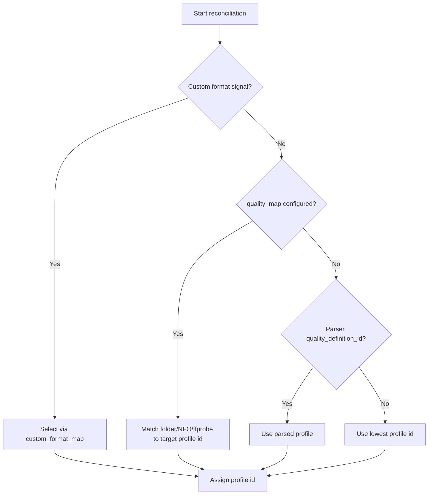

Assessment of quality_map and custom_profile/custom_format mapping, ffprobe relation, and DVD scenario

Executive summary
- quality_map and custom_format_map provide deterministic, policy-driven selection of the target quality profile id during reconciliation for items detected in the filesystem. This directly influences Radarr/Sonarr upgrade behavior for those items.
- They are optional and short-circuit safely: if empty, reconciliation won’t override profiles and falls back to parse or the lowest-profile fallback where applicable.
- ffprobe integration is optional and only used when explicitly enabled; it refines signal extraction for mapping.

Where this behavior is implemented
- Effective config resolution: [effective_radarr_quality_map()](librariarr/config.py:133)
- Media probing (optional): [collect_media_probe_text()](librariarr/quality.py:223); enable via analysis.use_media_probe and analysis.media_probe_bin parsed at [librariarr/config.py](librariarr/config.py:340)
- Profile selection order and mapping:
  - Quality-map path and fallbacks: [._resolve_profile_from_quality_map()](librariarr/sync/radarr_helper.py:250)
  - Lowest-profile fallback branches documented in code: [librariarr/sync/radarr_helper.py](librariarr/sync/radarr_helper.py:265) and [librariarr/sync/radarr_helper.py](librariarr/sync/radarr_helper.py:273)
- Diagnostics and validation against server definitions:
  - Radarr: [log_quality_mapping_diagnostics()](librariarr/sync/radarr_diagnostics.py:130)
  - Sonarr logging context for profile ids: [librariarr/sync/sonarr_diagnostics.py](librariarr/sync/sonarr_diagnostics.py:159)
- Verified behavior when no mapping is configured (skip profile override): [tests/service/test_reconcile_paths.py](tests/service/test_reconcile_paths.py:163)

What problem they solve (why use them)
- Prevent unintended upgrades for intentionally low-fidelity sources
  - Example: Physical DVD or SD TV captures that should remain as-is. Map those to an SD-restricted profile id so Radarr/Sonarr won’t queue upgrades.
- Normalize heterogeneous release naming into stable policy
  - Folders like “BDRip”, “Remux”, “BluRay-1080p”, “x265 HDR” can be normalized to the same target profile id to keep behavior consistent across imports.
- Integrate with Custom Formats–driven automation
  - If upgrade rules rely on CF scoring, custom_format_map aligns the initial profile to one that contains your CFs, preventing inconsistent early behavior.
- Category-specific policies
  - Apply different profiles for kids content, documentaries, anime, etc., encoding rules into mappings rather than ad-hoc manual fixes later.
- Safer auto-add for unparseable or nonstandard items
  - When parsing signals are weak or missing, mappings provide deterministic profile selection instead of defaulting to an inappropriate global profile.

Relation to ffprobe (“much logic for finally nothing?”)
- ffprobe use is explicitly opt-in and limited:
  - Only executed if analysis.use_media_probe is true, configured at [librariarr/config.py](librariarr/config.py:340).
  - It inspects the first video file to extract objective traits (e.g., resolution/codec) via [collect_media_probe_text()](librariarr/quality.py:223).
- If you keep it disabled, mapping relies only on folder names and optional NFO; the code path is correspondingly simpler and faster.

DVD scenario and upgrade semantics
- Goal: keep DVD quality and block upgrades
  - Configure quality_map rules that match your DVD/SD folder conventions (e.g., “DVD”, “SD”, “480p”) and map to an SD-only profile id. Selection occurs via [._resolve_profile_from_quality_map()](librariarr/sync/radarr_helper.py:250). Result: no upgrade searches in Radarr/Sonarr for those items, but items remain tracked.
- Goal: import as DVD but allow upgrades to 1080p/2160p
  - Either:
    1) Omit mapping (empty maps). The item uses the default/parsed profile and Radarr/Sonarr upgrade logic will proceed normally; or
    2) Map the same DVD signals to a higher-standard profile id specifically intended to trigger upgrades. Outcome: UI shows upgrades are wanted and searches follow your profile/CF rules.
- No mapping configured and ambiguous parse
  - The logic falls back to the parser’s quality_definition_id if present, otherwise to the lowest profile id with explicit logging, see [librariarr/sync/radarr_helper.py](librariarr/sync/radarr_helper.py:265) and [librariarr/sync/radarr_helper.py](librariarr/sync/radarr_helper.py:273). This reduces unintended aggressive upgrades when signals are weak.

Complexity trade-off and recommendations
- When mappings are justified:
  - Mixed or legacy naming schemes where server parsing is inconsistent
  - Strong CF-based policies where initial profile must align precisely
  - Content categories with divergent quality/codec policies
- When to simplify:
  - If you prefer Radarr/Sonarr defaults and uniform behavior across the library, set both quality_map and custom_format_map empty and keep analysis.use_media_probe false. Reconciliation then skips profile overrides, verified by [tests/service/test_reconcile_paths.py](tests/service/test_reconcile_paths.py:163), and server-side defaults drive upgrades.

Decision flow (high level)

Bottom line
- quality_map and custom_format_map act as explicit “target profile” selectors when you need deterministic policy enforcement at import time. They are optional, validated against server definitions, and short-circuit cleanly when left empty. ffprobe is an optional enhancer for signal extraction; if you don’t need it, keep it off and rely on default parser behavior or simple folder matching.
