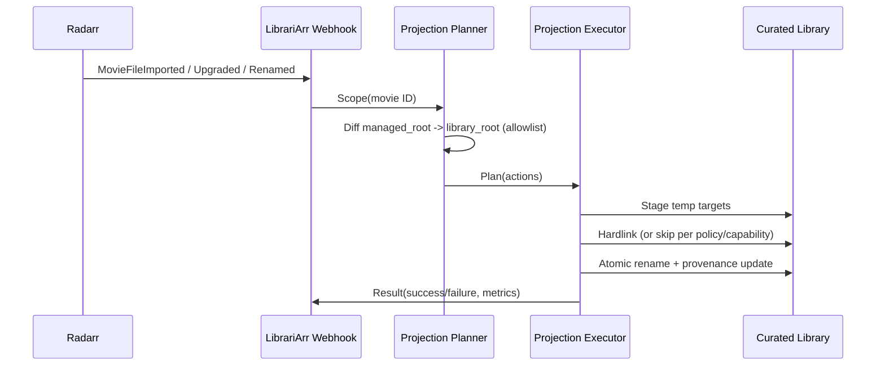

# Radarr Hooks-First Projection — Implementation Spec

Status: Draft (hooks-first baseline)
Date: 2026-03-18
Owner: LibrariArr maintainers

## 1) Goal

Protect user-curated movie libraries from destructive Arr folder operations while keeping storage overhead near zero for multi-terabyte libraries.

Core safety target:

- Radarr manages only an Arr-managed movie root it owns.
- LibrariArr projects selected files from the Arr-managed root into the curated library.
- LibrariArr never deletes unknown user-owned files.

## 2) Hardlink vs Symlink (Important)

These are not the same:

- **Symlink**: path pointer to another path.
  - If target is removed/replaced, link can break or point to changed content by path.
- **Hardlink**: second directory entry to the same inode.
  - Removing one path does not remove data while another hardlink exists.
  - Requires source and destination on the same filesystem.

For this architecture, hardlink is the default for large media files.

### 2.1 What "sidecar" means

Two different things are called sidecars in media workflows, so this spec separates them:

- **Managed extras sidecars**: user-visible small media-adjacent files such as `.srt`, `.nfo`, `poster.jpg`, `fanart.jpg`.
  - These are projected only when they match the allowlist.
- **Provenance sidecar**: LibrariArr-owned metadata file (for example `.librariarr-provenance.json`).
  - This is internal tracking data, not media content imported from Radarr.

## 3) Architecture Decision: Refactor, Not Rewrite

Recommendation: **radical refactor of current codebase**, not a full greenfield rewrite.

Why:

- Existing runtime, config, state store, job manager, and web framework are valuable and stable.
- A rewrite increases migration risk and slows delivery for no user-visible gain in phase 1.
- The projection engine can become a new isolated subsystem while keeping compatibility mode.

Decision:

- Keep process model, config loader, state store, and API server.
- Replace movie sync behavior with a new hooks-first projection pipeline.
- Migrate movie handling in one step to projection mode (no long-term dual movie modes).

## 4) Scope

In scope:

- Movies/Radarr first.
- Hooks-first reconcile triggering.
- File-level projection (video + allowlisted sidecars).
- Managed-only cleanup based on provenance.
- Existing library bootstrap without full copies when possible.
- Admin UI simplification around projection settings and health.

Out of scope (later phases):

- Sonarr production rollout (design included, implementation deferred).
- Overlay/union filesystem runtime mode.
- Content-addressed storage backend.

## 5) End-State Architecture

```mermaid
flowchart LR
  RW[Radarr Webhooks] --> Q[Reconcile Queue]
  RP[Periodic Drift Reconcile] --> Q
  Q --> MP[Movie Projection Planner]
  MP --> ME[Movie Projection Executor]
  ME --> ST[Projection State + Provenance]
  S[Radarr Managed Root (persistent)] --> MP
  C[Curated Library (user-owned)] <-->|hardlink/copy allowlist| ME
```

### 5.1 Behavior Summary

- Radarr root points to managed root (real folder tree, persistent).
- Managed root is long-lived; it is not created per movie arrival and not auto-deleted after projection.
- Webhooks trigger scoped movie reconcile quickly.
- Periodic reconcile remains as a drift-recovery safety net.
- Curated library keeps unmanaged extras untouched.
- Path examples in this document are illustrative only; actual movie folder/file names follow Radarr naming and/or admin naming policy.

## 6) Managed Root Lifecycle

Managed root lifecycle:

1. Created during setup/bootstrap (or first run if missing).
2. Remains persistent and Radarr-owned.
3. Receives imports/upgrades/renames from Radarr.
4. Serves as the source of truth for managed movie files.

Important policy:

- Do not treat managed root as temporary scratch that is deleted after projection.
- Deletion in managed root is controlled by Radarr policy and recycle bin settings.

## 7) Trigger Strategy (Hooks-First)

Primary trigger:

- Radarr Connect Webhook events (import, upgrade, rename, delete).

Secondary trigger:

- Scheduled full reconcile every N minutes for missed-event recovery.

File watchers:

- Not required for movie sync in this architecture.
- Keep only webhook + periodic reconcile for movies.

Recommended default:

- hooks-first with periodic drift reconcile.

### 7.1 Webhook security and queue resiliency

- Endpoint remains fixed: `/api/hooks/radarr`.
- Validate webhook calls via optional shared secret header (for example `X-Librariarr-Webhook-Secret`) sourced from environment.
- Deduplicate bursty webhook traffic using a key: `movie_id + event_type + normalized_path + time_bucket`.
- Use per-movie queue coalescing (newest event wins) to prevent event storms from causing redundant reconcile cycles.
- Apply bounded queue backpressure with explicit skip/coalesce metrics when queue limits are reached.

### 7.2 User changes in library root (rename/delete)

Source-of-truth rule:

- `managed_root` is authoritative for managed movie files.
- `library_root` is a projection target.

Behavior when user changes files directly in `library_root`:

- If user renames/deletes a **managed** projected file, LibrariArr recreates the expected managed file on next reconcile.
- If user deletes a projected movie folder, LibrariArr recreates it on next reconcile (from `managed_root`).
- If user adds/renames/deletes **unknown** extras (not managed by provenance), LibrariArr does not remove them.

How changes are detected without watchers:

- Immediate updates come from Radarr webhooks (when managed root changed by Radarr).
- User-only library edits are detected by periodic reconcile (or manual reconcile API call).
- Therefore, user edits in `library_root` are eventually reconciled, not instant.

## 8) Configuration Model

Adopt a user-understandable multi-root mapping model for movies.

```yaml
paths:
  movie_root_mappings:
    - managed_root: "/data/radarr_movies_main"
      library_root: "/data/movies/main"
    - managed_root: "/data/radarr_movies_kids"
      library_root: "/data/movies/kids"

radarr:
  projection:
    managed_video_extensions: [".mkv", ".mp4", ".avi", ".m2ts", ".mov"]
    managed_extras_allowlist:
      - "*.srt"
      - "*.sub"
      - "movie.nfo"
      - "poster.jpg"
      - "fanart.jpg"
    preserve_unknown_files: true
    delete_managed_files: true
    provenance_file: ".librariarr-provenance.json"
    hash_max_file_size_mb: 256
    movie_folder_name_source: "managed" # managed | radarr

runtime:
  periodic_reconcile_minutes: 180
```

Path naming note:

- `/data/radarr_movies_main/Foo (2020)/Foo (2020).mkv` is only an example.
- Radarr may name files using release-style names or configured rename patterns.
- LibrariArr uses stable movie identity (`movie.id`) for reconciliation; paths are treated as mutable.

Webhook setup (fixed, no extra config keys):

- `radarr.url` in `config.yaml` is for **LibrariArr -> Radarr API** requests.
- Radarr webhook is **Radarr -> LibrariArr** and uses a fixed endpoint: `/api/hooks/radarr`.
- In Radarr Connect, set webhook URL to `http://<librariarr-host>:8787/api/hooks/radarr`.
- This endpoint path is intentionally fixed to reduce config complexity and avoid drift.

This is the canonical movie configuration model for this architecture.

Removed from codebase after movie cutover (explicit implementation instructions):

1. **Remove movie symlink creation path**
  - Delete movie usage of `ShadowLinkManager` in `librariarr/service/reconcile.py`.
  - Retain Sonarr symlink path temporarily until Sonarr projection phase.

2. **Remove movie symlink cleanup path**
  - Delete movie usage of `ShadowCleanupManager` in `librariarr/service/reconcile.py` and bootstrap wiring.
  - Keep Sonarr cleanup path only during transition.

3. **Remove movie watcher-trigger dependency**
  - In `librariarr/runtime/loop.py`, remove movie-specific filesystem event triggers.
  - Movie reconcile triggers must be webhook + periodic reconcile only.

4. **Remove movie ingest flow tied to shadow roots**
  - Remove movie ingest wiring via `ShadowIngestor` from `librariarr/service/bootstrap.py`.
  - Keep/adjust any Sonarr-specific ingest only if still required before Sonarr migration.

5. **Remove legacy movie root naming from config model**
  - Replace movie use of `paths.root_mappings` (`nested_root`/`shadow_root`) with `paths.movie_root_mappings` (`managed_root`/`library_root`).
  - Update `librariarr/config/models.py` and `librariarr/config/loader.py` accordingly.

6. **Remove legacy movie docs/UI language**
  - Remove “shadow root / nested root” movie wording from docs and UI labels.
  - Use `managed_root` / `library_root` consistently for movie projection mode.

7. **Delete dead movie code after Phase 1.5 verification**
  - After successful one-step cutover and rollback window, remove dead movie-only symlink/watcher helper code paths instead of leaving dormant branches.

Validation rules:

- `paths.movie_root_mappings` is required for movie projection mode.
- Every `managed_root` and `library_root` must be absolute.
- `managed_root` and `library_root` must not overlap.
- A `managed_root` may map to exactly one `library_root`.
- Projection is hardlink-only for media files in v1.
- If managed and library roots are on different filesystems, projection for those movies is skipped with a warning.
- `preserve_unknown_files` is forced `true` for v1 safety.
- Movie webhook endpoint is fixed at `/api/hooks/radarr`.

### 8.1 Capability probes (startup and config-change)

For each movie root mapping, probe and persist:

- hardlink capability (same-device check),
- write permissions on `managed_root` and `library_root`,
- free-space and temp-write viability in `library_root`.

Expose probe results in runtime status and UI so operators can see why a movie was projected or skipped.

## 9) Provenance and State

Default state backend:

- Use SQLite as the canonical projection state store (for example `librariarr-state.db`).
- Keep JSON export/import as an optional support/debug format, not as the primary runtime store.

Logical projection record example (format illustration):

```json
{
  "projection": {
    "schema_version": 1,
    "movies": {
      "123": {
        "movie_id": 123,
        "radarr_path": "/data/radarr_movies_main/Foo (2020)",
        "curated_path": "/data/movies/Foo (2020)",
        "updated_at": 1710000000,
        "needs_reconcile": false,
        "files": {
          "Foo (2020).mkv": {
            "managed": true,
            "kind": "video",
            "source_path": "/data/radarr_movies_main/Foo (2020)/Foo (2020).mkv",
            "dest_path": "/data/movies/Foo (2020)/Foo (2020).mkv",
            "source_dev": 2050,
            "source_inode": 993311,
            "size": 7340032000,
            "mtime": 1710000000,
            "hash": "..."
          }
        }
      }
    }
  }
}
```

Deletion eligibility (all required):

1. File is in state for same movie id.
2. File is `managed=true`.
3. Path matches expected managed path.
4. Fingerprint check passes.

Unknown curated files are never deleted.

### 9.1 Provenance recovery behavior

If provenance sidecar is missing or corrupted:

- do not delete anything in that folder,
- attempt reconstruction by matching projected files against managed-root fingerprints,
- if reconstruction fails, mark folder/movie as `unknown_state` and require explicit reconcile recovery.

## 10) Existing Library Bootstrap (No Full Copy by Default)

Goal: onboard current curated library into Radarr managed roots without duplicating terabytes.

Preferred path (same filesystem):

1. Create managed-root folder for each movie.
2. Create hardlink for main video from curated -> managed root.
3. Optionally hardlink allowlisted sidecars.
4. Import managed root into Radarr as existing library.
5. Start projection reconcile.

If different filesystems:

- Hardlink is not possible in v1.
- Skip projection for those movies, mark status as `needs_manual_migration`, and surface clear UI warnings.

Bootstrap hardening:

- If a destination file already matches managed-root fingerprint, adopt it as managed state without destructive rewrite.
- Optional name normalization remains an explicit admin action, not default behavior.

## 11) Radical Refactor Plan (Hooks-First)

### Workstream A — New projection domain

Create new modules:

- `librariarr/projection/models.py`
- `librariarr/projection/planner.py`
- `librariarr/projection/executor.py`
- `librariarr/projection/provenance.py`
- `librariarr/projection/bootstrap.py`

Rules:

- Planner is pure/deterministic.
- Executor is side-effecting/atomic.
- Orchestration is thin and testable.

### Workstream B — Service orchestration simplification

Refactor `service/reconcile.py` to a thin orchestrator:

- movie path uses projection orchestrator only.
- keep Sonarr path unchanged initially.

### Workstream C — Runtime trigger simplification

- Add webhook router and queue integration.
- Reduce watcher dependence in projection mode.
- Keep periodic reconcile timer for drift recovery.

### Workstream D — Cleanup policy hardening

- Replace folder/symlink-centric cleanup with managed-file cleanup in projection mode.
- Enforce provenance checks before deletion.

### Workstream E — Compatibility and migration

- Explicit migration command/endpoint for bootstrap planning.
- One-step movie cutover runbook (pre-check, cutover, verify, rollback).

## 12) Admin UI Simplification Plan

Projection-mode UI can be simpler than current watcher-centric UX.

Show only:

1. Mode and roots:
  - movie projection active,
  - managed roots,
  - library roots,
  - root mapping health.
2. Safety controls:
   - preserve unknown files (locked on),
   - managed delete policy,
   - recycle-bin reminder.
3. Trigger health:
   - webhook configured/last event,
   - periodic reconcile status.
4. Operational state:
   - last reconcile summary,
   - per-movie failures and retry queue.

This removes the need to expose most filesystem watcher complexity when in hooks-first mode.

## 13) Sonarr Compatibility Strategy

Yes, the same architecture works for Sonarr, but in phase 2+.

Same model:

- Sonarr managed root (owned by Sonarr) -> projection into curated series library.

Additional Sonarr-specific complexity:

- season folder conventions,
- multi-episode files,
- frequent rename churn,
- subtitle/artwork volume.

Plan:

- Reuse projection engine with pluggable media-kind strategy.
- Implement Sonarr planner policy once Radarr movie path is stable in production.

## 14) Implementation Phases

### Phase 0 — Contract lock and scaffolding

Objective:

- Lock data contracts and create safe scaffolding without behavior changes.

Implementation:

- Define `paths.movie_root_mappings` and `radarr.projection` schema in config model/loader.
- Add projection state schema (`projection.schema_version`, per-movie records).
- Introduce state backend interface and SQLite implementation (WAL mode + migrations).
- Add JSON-to-SQLite migration utility for existing state files.
- Add projection module skeletons:
  - `librariarr/projection/models.py`
  - `librariarr/projection/planner.py`
  - `librariarr/projection/executor.py`
  - `librariarr/projection/provenance.py`
  - `librariarr/projection/bootstrap.py`

Exit criteria:

- Config loads with new schema.
- SQLite state store reads/writes projection namespace safely.
- No movie runtime behavior change yet.

### Phase 1 — Hooks-first projection runtime (add/update only)

Objective:

- Deliver first production-capable projection pipeline without managed deletions.

Implementation:

- Implement webhook endpoint `/api/hooks/radarr` and queue scoped movie reconciles.
- Implement planner/executor for managed file add/update.
- Keep periodic full reconcile as drift safety net.
- Implement hardlink eligibility checks and skip-on-cross-filesystem status reporting.
- Add webhook dedupe/coalescing and bounded queue backpressure.
- Add webhook shared-secret validation (when configured via environment).
- Use SQLite-backed queues/state tables for reconcile bookkeeping and idempotency keys.

Exit criteria:

- New/updated movies from Radarr reconcile into `library_root`.
- Reconcile is idempotent.
- Unknown files in `library_root` remain untouched.

### Phase 1.5 — One-step movie cutover and legacy removal

Objective:

- Switch movie sync fully to projection model and remove obsolete movie paths.

Implementation (explicit removals):

- Remove movie symlink creation path (`ShadowLinkManager` usage) from movie flow.
- Remove movie symlink cleanup path (`ShadowCleanupManager` usage) from movie flow.
- Remove movie watcher-trigger dependency from `librariarr/runtime/loop.py`.
- Remove movie ingest path tied to shadow roots (`ShadowIngestor` movie wiring).
- Replace movie naming/config usage from `paths.root_mappings` to `paths.movie_root_mappings`.

Cutover runbook:

- Stop movie watcher path.
- Apply migration config.
- Run bootstrap import + first full reconcile.
- Verify webhook delivery, projection state, and dashboard health.

Exit criteria:

- Movie sync path is webhook + periodic reconcile only.
- No dead legacy movie branches remain active.

### Phase 2 — Managed cleanup and reconcile hardening

Objective:

- Enable safe managed-file deletions and robustness.

Implementation:

- Enable managed-only delete/replace actions with strict provenance checks.
- Add failure handling and retry markers (`needs_reconcile`).
- Add per-movie atomic apply + rollback-safe behavior.
- Add managed-file quarantine before permanent deletion with retention policy.

Exit criteria:

- Superseded managed files are cleaned safely.
- Unknown files are never deleted.

### Phase 3 — Bootstrap tooling and admin UX simplification

Objective:

- Improve operations and make the new model easy to run.

Implementation:

- Add existing-library bootstrap helper workflow.
- Expose projection-centric health, queue, and failure diagnostics in UI.
- Remove legacy movie terminology from docs/UI (`shadow/nested`) in movie context.
- Add optional advanced cross-filesystem fallback policy (reflink/copy) as an opt-in extension; default remains skip.

Exit criteria:

- Operators can onboard existing libraries with clear diagnostics.
- UI reflects only projection-relevant movie controls.

### Phase 4 — Sonarr extension

Objective:

- Reuse the same engine for series with Sonarr-specific planner behavior.

Implementation:

- Introduce media-kind strategy layer for series-specific rules.
- Add Sonarr webhook-driven scoped reconcile path.
- Migrate Sonarr flow from watcher-centric behavior to hooks-first where feasible.

Exit criteria:

- Sonarr projection behaves equivalently to Radarr safety guarantees.

## 15) Test Strategy

Unit tests:

- planner diff determinism,
- property-style determinism checks for repeated randomized planner inputs,
- hardlink eligibility checks (same filesystem required),
- deletion eligibility guardrails,
- event payload to reconcile scope mapping.
- webhook dedupe/coalescing behavior.

Integration tests:

- hardlink inode behavior,
- atomic temp+rename apply,
- unknown file preservation,
- upgrade path replacing managed file only.
- fault-injection tests for partial executor failures and rollback integrity.

E2E tests:

- webhook import/upgrade/rename/delete flows,
- periodic reconcile drift recovery,
- bootstrap onboarding from existing curated library.
- queue backpressure and coalescing behavior under burst events.

Repository wrappers:

- `./run.sh test`
- `./run.sh quality`

## 16) Acceptance Criteria

1. Unknown curated files are never deleted.
2. Existing-library bootstrap avoids full copy when same filesystem.
3. Webhook event updates targeted movie in one reconcile cycle.
4. Periodic reconcile repairs drift after missed hooks.
5. Reconcile is idempotent (no-op when unchanged).
6. Projection-mode UI presents only projection-relevant controls.
7. Movie sync runs without filesystem watchers (hooks + periodic reconcile only).

## 17) Open Decisions

1. Sidecar provenance default: required vs optional.
2. Whether Sonarr keeps watcher-based triggers or also moves to hooks-first.
3. Whether advanced opt-in cross-filesystem fallback chain (reflink/copy) is enabled in non-v1 profiles.
4. Windows/NAS support profile scope and capability requirements.

Current recommendation:

- hardlink-only movie projection in v1
- always write `provenance_file=.librariarr-provenance.json`
- one-step movie cutover to projection mode.

## 18) Event Contract Appendix

Webhook event types consumed (minimum contract):

- Import/Download: `movie.id`, movie path, imported file path(s).
- Upgrade: `movie.id`, previous file path, new file path.
- Rename: `movie.id`, old path, new path.
- MovieFileDeleted: `movie.id`, deleted path.

Idempotency rule:

- Repeated identical events are safe; dedupe prevents redundant work, and planner output remains deterministic.

## 19) Performance Budgets

Operational limits (initial targets):

- Hashing budget per cycle: bounded by configured max file size and per-cycle cap.
- Max concurrent movie applies: bounded worker count to prevent IO spikes.
- Queue size cap: bounded; excess events are coalesced by movie id.

## 20) State-Loss Recovery

If the SQLite state database is missing or damaged:

- rebuild projection state by scanning managed/library roots and matching fingerprints,
- mark movies as `recovered` or `unknown_state`,
- block managed deletions until recovery passes consistency checks.

## 21) Sequence Flow (Webhook to Projection)


