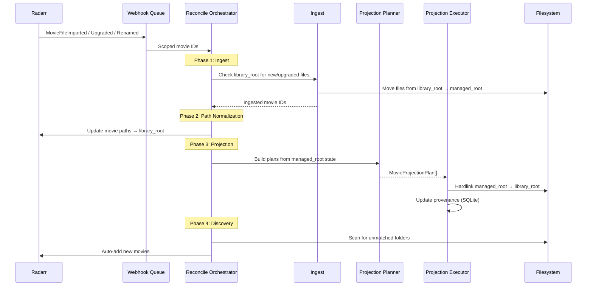

# Radarr Projection Architecture

Status: Living document — reflects current implementation
Last updated: 2026-04-26

## 1) Goal

Protect user-curated movie libraries from destructive Arr folder operations while keeping storage overhead near zero for multi-terabyte libraries.

Core safety invariants:

- Radarr manages only a flat library root that LibrariArr owns.
- The user's curated folder tree (managed root) is the source of truth.
- LibrariArr projects selected files from managed root → library root via hardlinks.
- LibrariArr ingests new/upgraded files from library root → managed root.
- LibrariArr never deletes unknown user-owned files.

## 2) Hardlinks

Hardlink: second directory entry pointing to the same inode. Removing one path does not remove data while another hardlink exists. Requires source and destination on the same filesystem.

For this architecture, hardlink is the only supported projection mechanism. Cross-filesystem mappings are detected at startup and skipped with a warning.

## 3) Path Direction (Critical)

Understanding the path direction is essential:

```
User's curated library          Radarr's root folder
(managed_root)          →       (library_root)
/data/movies/age_06/            /data/radarr_library/age_06/
```

- **managed_root**: the user's curated folder tree. Persistent. Never auto-deleted. This is where movies "live" long-term.
- **library_root**: Radarr's root folder. Contains hardlink projections of managed files. Radarr reads from and writes to this folder.

**Radarr is pointed at library_root**, not managed_root. `normalize_radarr_paths_to_library_roots()` ensures every movie in Radarr has its path set to `library_root/<movie_folder>`.

Direction summary:
- **Projection** (managed → library): hardlink managed files into library root so Radarr can see them.
- **Ingest** (library → managed): move new/upgraded files from library root into managed root so projection can re-hardlink them.

## 4) Architecture Overview

```
Radarr                    LibrariArr                    Filesystem
──────                    ──────────                    ──────────
webhook ───────────────→  Webhook Queue
                          ↓
periodic timer ────────→  Reconcile Orchestrator
filesystem watcher ────→  │
                          ├─ Ingest (library → managed)
                          │   ├─ Folder-level (new movies)
                          │   └─ File-level (upgrades, inode comparison)
                          │
                          ├─ Path Normalization (ensure Radarr → library_root)
                          │
                          ├─ Projection (managed → library)
                          │   ├─ Planner (pure/deterministic)
                          │   ├─ Executor (hardlink, atomic temp+rename)
                          │   └─ Provenance (SQLite state)
                          │
                          └─ Discovery (auto-add unmatched folders)
```

## 5) Configuration

```yaml
paths:
  movie_root_mappings:
    - managed_root: "/data/movies/main"
      library_root: "/data/radarr_library/main"
    - managed_root: "/data/movies/kids"
      library_root: "/data/radarr_library/kids"

radarr:
  projection:
    managed_video_extensions: [".mkv", ".mp4", ".avi", ".m2ts", ".mov"]
    managed_extras_allowlist:
      - "*.srt"
      - "*.sub"
      - "movie.nfo"
      - "poster.jpg"
      - "fanart.jpg"
    preserve_unknown_files: true   # forced true in v1

ingest:
  enabled: true

runtime:
  periodic_reconcile_minutes: 180
```

### 5.1 Validation Rules

- `paths.movie_root_mappings` is required for movie projection mode.
- Every `managed_root` and `library_root` must be absolute paths.
- `managed_root` and `library_root` must not overlap.
- A `managed_root` maps to exactly one `library_root`.
- If managed and library roots are on different filesystems, that mapping is skipped with a warning.
- `preserve_unknown_files` is forced `true` for v1 safety.

### 5.2 Capability Probes

At startup, for each movie root mapping, LibrariArr probes:

- Hardlink capability (same-device check via `st_dev` comparison).
- Write permissions on both `managed_root` and `library_root`.
- Temp-file write viability in `library_root`.
- Free space in `library_root`.

Probe results are exposed in runtime status so operators can diagnose why a mapping is skipped.

Implementation: `librariarr/projection/bootstrap.py` — `probe_movie_root_mappings()`.

## 6) Trigger Strategy

Three triggers, in priority order:

1. **Radarr Webhooks** (primary): scoped per-movie reconcile via `/api/hooks/radarr`.
2. **Filesystem Watchers**: watchdog-based monitoring of managed and library roots, with debounce.
3. **Periodic Full Reconcile**: scheduled drift-recovery safety net (default: every 180 minutes).

### 6.1 Webhook Details

- Fixed endpoint: `/api/hooks/radarr` (no configuration needed).
- Optional shared-secret validation via `X-Librariarr-Webhook-Secret` header.
- Deduplicate bursty traffic using key: `movie_id + event_type + normalized_path + time_bucket`.
- Per-movie queue coalescing: newest event wins.
- Bounded queue (default 2000) with explicit drop metrics when limit is reached.
- Consumed webhook events produce scoped `movie_id` sets for targeted reconcile.

Implementation: `librariarr/projection/webhook_queue.py` — `RadarrWebhookQueue`.

### 6.2 Webhook Event Contract

Consumed event types:

- `Download` / `MovieFileImported`: new import or upgrade.
- `Rename`: movie path changed.
- `MovieFileDeleted`: managed file removed.

Idempotency: repeated identical events are safe; dedupe prevents redundant work, planner output is deterministic.

### 6.3 Filesystem Watchers

Watchdog observers monitor both `managed_root` and `library_root` directories. Events trigger debounced reconcile cycles with affected-path scoping.

Implementation: `librariarr/runtime/loop.py` — `RuntimeSyncLoop` with `Observer`/`PollingObserver`.

## 7) Reconcile Flow

Each reconcile cycle runs these phases in order:

### 7.1 Ingest (library → managed)

Moves files that Radarr placed in library_root back into managed_root. Two tiers:

**Folder-level ingest** (new movies):
- For each Radarr movie whose path is under a `library_root`:
  - Compute the equivalent `managed_root` path.
  - If managed folder does **not** exist: move the entire folder from library_root to managed_root.
  - This handles brand-new movie imports where Radarr creates a new folder.

**File-level ingest** (upgrades):
- For each Radarr movie where the managed folder **already** exists:
  - Walk the library folder and classify each file (video, extra, or ignored) using the projection allowlist.
  - For each allowlisted file: compare inodes between library and managed copies.
  - If inodes differ (upgrade): atomically move the library file to managed_root using rename-to-backup pattern.
  - If inodes match (already hardlinked): skip — no action needed.
  - Safety: backup is created before move; restored on failure; deleted on success.

Implementation: `librariarr/service/reconcile.py` — `_ingest_movies_from_library_roots()`, `_ingest_movie_if_needed()`, `_ingest_files_for_existing_movie()`. Helper: `librariarr/service/reconcile_helpers.py` — `ingest_files_from_library_folder()`.

### 7.2 Path Normalization

Ensure every Radarr movie has its path set to the library_root equivalent. Movies pointing to managed_root are updated to point to library_root.

Implementation: `librariarr/service/path_normalization.py` — `normalize_radarr_paths_to_library_roots()`.

### 7.3 Projection (managed → library)

Core hardlink projection pipeline:

1. **Planner** (`librariarr/projection/planner.py`):
   - Fetch all movies from Radarr API.
   - For each movie, resolve which mapping applies.
   - Walk the managed folder and classify files against the allowlist.
   - Produce a deterministic `MovieProjectionPlan` with `PlannedProjectionFile` entries.

2. **Executor** (`librariarr/projection/executor.py`):
   - For each planned file, check if destination already exists with same inode.
   - If same inode: skip (already projected).
   - If different inode or missing: create hardlink using atomic temp+rename pattern.
   - Track all projected files in provenance state.

3. **Provenance** (`librariarr/projection/provenance.py`):
   - SQLite database (WAL mode) recording per-file projection state.
   - Schema: `movie_id, dest_path, source_path, kind, managed, source_dev, source_inode, size, mtime, file_hash, updated_at`.
   - Used to determine which files are managed (projected by LibrariArr) vs. unknown (user-owned).
   - Managed paths are queried before executor runs to detect files that need re-projection.

4. **Orchestrator** (`librariarr/projection/orchestrator.py`):
   - Thin coordinator: fetches movies → calls planner → probes mappings → calls executor.
   - Supports scoped reconcile (set of movie IDs) or full reconcile (all movies).

### 7.4 Discovery

Scan managed roots for movie folders not yet in Radarr. Auto-add unmatched folders when `auto_add_unmatched` is enabled. Newly added movies trigger immediate projection.

Implementation: `librariarr/sync/discovery.py`, wired via `_auto_add_unmatched_movies()` in reconcile.

### 7.5 Scope Resolution

Reconcile scope is determined by combining:
- Webhook queue (consumed movie IDs).
- Ingested movie IDs (from ingest phase).
- Auto-added movie IDs (from discovery phase).
- Incremental affected paths (from filesystem watchers).

If any scoping source provides IDs, only those movies are reconciled. Otherwise, full reconcile runs.

## 8) Module Map

```
librariarr/
  projection/
    models.py          — Data classes: MovieProjectionMapping, MovieProjectionPlan,
                         PlannedProjectionFile, MappingProbeResult, ProjectedFileState,
                         ProjectionApplyMetrics
    planner.py         — build_movie_projection_plans(), classify_file()
    executor.py        — MovieProjectionExecutor.apply()
    provenance.py      — ProjectionStateStore (SQLite)
    bootstrap.py       — probe_movie_root_mappings()
    orchestrator.py    — MovieProjectionOrchestrator.reconcile()
    webhook_queue.py   — RadarrWebhookQueue, SonarrWebhookQueue

  service/
    reconcile.py       — ServiceReconcileMixin: full reconcile orchestration,
                         ingest (folder-level + file-level), discovery wiring
    reconcile_helpers.py — ingest_files_from_library_folder(), classify/move helpers
    path_normalization.py — normalize_radarr_paths_to_library_roots()
    bootstrap.py       — ServiceBootstrapMixin: initializes projection orchestrators

  runtime/
    loop.py            — RuntimeSyncLoop: filesystem watchers, debounce, periodic timer
    status.py          — RuntimeStatusTracker: phase tracking for UI

  config/
    models.py          — AppConfig, PathsConfig, RadarrProjectionConfig, IngestConfig
    loader.py          — YAML parsing with env var overrides
```

## 9) Provenance State

All projection state is stored in a single SQLite database (`librariarr-projection.db`, WAL mode).

Schema:

```sql
CREATE TABLE projected_files (
    movie_id     INTEGER NOT NULL,
    dest_path    TEXT NOT NULL,
    source_path  TEXT NOT NULL,
    kind         TEXT NOT NULL,       -- "video" | "extra"
    managed      INTEGER NOT NULL,    -- 1 = projected by LibrariArr
    source_dev   INTEGER,
    source_inode INTEGER,
    size         INTEGER NOT NULL,
    mtime        REAL NOT NULL,
    file_hash    TEXT,                -- reserved, currently NULL
    updated_at   REAL NOT NULL,
    PRIMARY KEY (movie_id, dest_path)
);
```

Key operations:
- `upsert_projected_files()`: record projection state after executor applies.
- `get_managed_paths_for_movie()`: query which dest paths are managed before executor runs.
- `remove_movie()`: clean up state when a movie is removed.
- Periodic maintenance: vacuum and integrity checks (every 24h).

## 10) Safety Guarantees

1. **Unknown files are never deleted.** `preserve_unknown_files` is forced `true`. Only files tracked in provenance as `managed=1` are candidates for re-projection.
2. **Hardlink-only.** No file copying. If managed and library roots are on different filesystems, the mapping is skipped entirely.
3. **Atomic file operations.** Executor uses temp file + rename pattern. Ingest uses backup + rename pattern with rollback on failure.
4. **Idempotent reconcile.** Running reconcile repeatedly with no changes produces no side effects.
5. **Scoped reconcile.** Webhook events target specific movie IDs, avoiding unnecessary full-library scans.

## 11) Sonarr Status

Sonarr projection is **partially implemented** using the same engine:

- `librariarr/projection/sonarr_orchestrator.py` and `sonarr_planner.py` exist and are functional.
- Sonarr config uses legacy naming (`nested_root`/`shadow_root` instead of `managed_root`/`library_root`).
- Sonarr-specific complexity (season folders, multi-episode files) is handled in the planner.
- Sonarr webhook queue (`SonarrWebhookQueue`) is implemented.

Remaining work: migrate Sonarr config model to use `managed_root`/`library_root` naming consistently.

## 12) Sequence Diagram



## 13) Future Considerations

These are potential improvements, not committed work:

- **Existing-library bootstrap**: tooling to onboard an existing curated library into LibrariArr without duplicating files (hardlink from curated → managed, then import to Radarr).
- **Managed-file cleanup**: delete superseded managed files from library_root based on provenance checks.
- **Cross-filesystem fallback**: optional reflink/copy mode for mappings where hardlink is not possible.
- **Sonarr config migration**: rename `nested_root`/`shadow_root` to `managed_root`/`library_root`.
